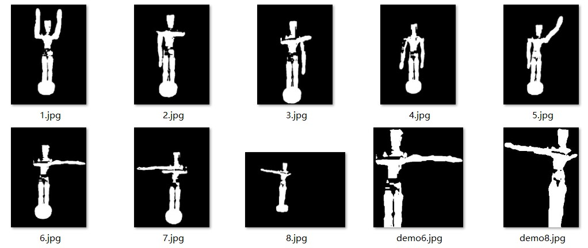
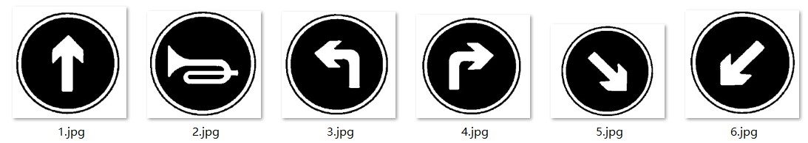
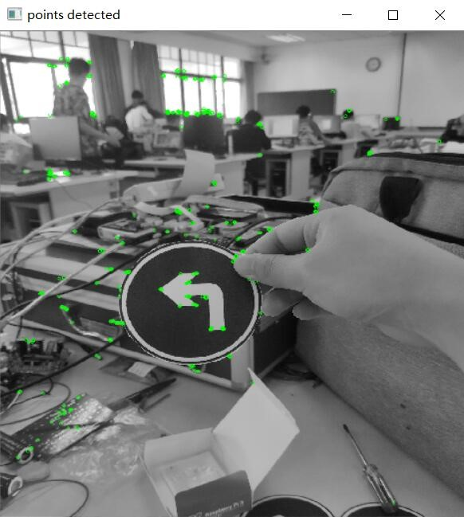
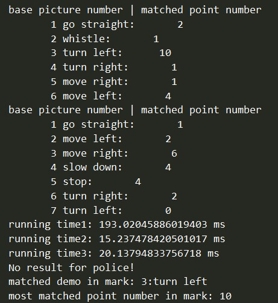
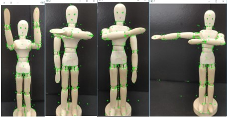
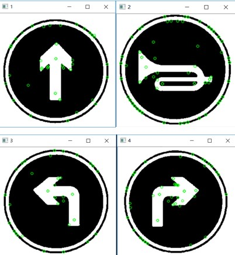
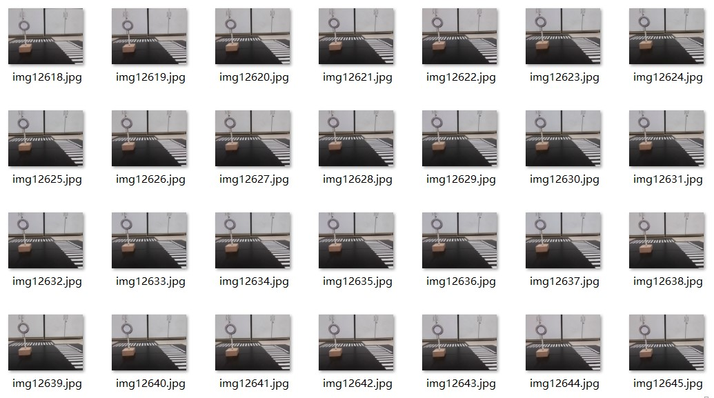
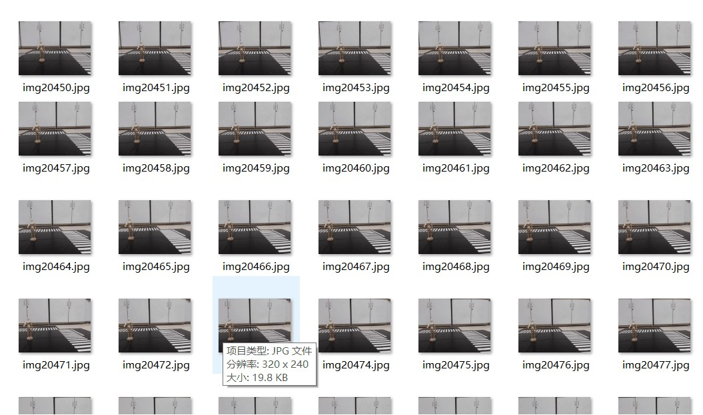
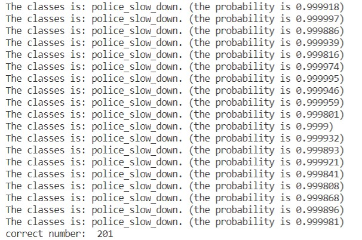
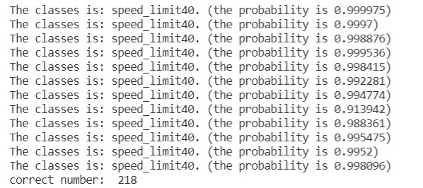

# DriverlessCar

>注意：最后实现的那套代码方案在deep_learning2文件夹内，且该repository不包含采集的数据图片样本

本项目是基于Raspberry Pi 3B+嵌入式系统的无人驾驶小车设计，为2017级浙江大学电气工程学院爱迪生实验班信号分析与处理项目。

## 预处理

包含调用OpenCV的滤波、色彩空间转换等预处理方法。

1. 在这里通过转换RGB色彩空间到YUV/YCbCr，可以实现背景的去除，将与肤色相近的色彩滤出来。

2. 建立模板库的时候需要用到自适应二值化处理方法，将模板处理成黑白的。

## 图片匹配

均需要建立交通标志和交警手势的模板库，一些demo如下：


 

1. 模板匹配（Template Match）

2. 特征点检测与匹配

    目前主流的图像特征点检测算法有Harris角点检测、SIFT、SURF、ORB等，由于其原理牵涉到曲率、梯度等复杂的数学问题，在此略去不表。由于上述几种算法在OpenCV中均有API可供调用，因此以下仅就本项目中检测和匹配的实现以及它们之间的差别作简要说明，包括调用OpenCV的SIFT、SURF、ORB算法及其比较。

    - SIFT（尺度不变性特征变换）算法

    - SURF（加速鲁棒性特征）算法

    - ORB（Oriented FAST and Rotated BRIEF）

     
     

## Machine Learning方法（CNN模型）

1. 训练样本采集

    前前后后估摸着采集了近万张的图片......

     

2. 图片数据预处理


3. 建立CNN Model

    搭建一个卷积神经网络模型，包括两个Convolution + Pooling layer、全连接层、Dropout、全连接层、Softmax输出层。

    - 卷积层（Convolutional Layer）

        卷积神经网络中每层卷积层由若干卷积单元组成，每个卷积单元对应一个特定步长、权值和大小的卷积核。相应的，对每一个卷积核，卷积操作将得到对应的feature map。比如对原始4\*4的图片，使用2种2\*2的卷积核，得到两个3*3的feature map。

    - 池化层（Pooling Layer）

        实际上是一种形式的降采样。有多种不同形式的非线性池化函数，而其中Max pooling是最为常见的。它是将输入的图像划分为若干个矩形区域，对每个子区域输出最大值。这种机制能够有效地原因在于，在发现一个特征之后，它的精确位置远不及它和其他特征的相对位置的关系重要。池化层会不断地减小数据的空间大小，因此参数的数量和计算量也会大幅度下降，这在一定程度上也控制了过拟合。因此CNN的卷积层之间都会周期性地插入池化层。池化层通常会分别作用于每个输入的特征并减小其大小。本项目采用**最大值池化方式（2*2）**。

    - 全连接

    - 随机失活 DropOut

4. 模型架构

    | 类型 | Kernel尺寸/步长（或注释） | 输入尺寸 |
    |  ----  |  ----  |  ----  |
    | 卷积 | 3\*3\*16/1 | 128\*128\*1 |
    | 池化 | 2\*2/2 | 128\*128\*16 |
    | 卷积 | 3\*3\*32/1 | 64\*64\*16 |
    | 池化 | 2\*2/2 | 64\*64\*32 |
    | 全连接 | (32\*32\*32)\*256 | 1\*(32\*32\*32) |
    | Dropout | 随机失活 | 1\*256 |
    | 全连接 | 256\*(classnumber) |1\*256 |
    | Softmax | probabilities | (classnumber) |

5. 训练参数

    - Learning Rate: 0.0001

    - Batch Size: 50

    - Epoch: 50

    - dropout ratio: 0.4

    - loss function: cross entropy/softmax

    - 随机梯度下降减小loss function

```py
def parse_arguments(argv):  
    parser = argparse.ArgumentParser()  
  
    parser.add_argument('--learning_rate', type=float,  
                        help="learning rate", default=1e-4)
    parser.add_argument('--batch_size', type=float,  
                        help="batch_size", default=50)
    parser.add_argument('--epoches', type=float,  
                        help="epoches", default=50)
    parser.add_argument('--keep_prob', type=float,  
                        help="keep prob", default=0.6)
    return parser.parse_args(argv)
```

**注意：最后实现的方案鲁棒性较差，建议之后改进识别模型时，进一步优化前述背景剔除的方法**

6.部分模型测试结果呈现

 

## Notes

- 将训练好的CNN Model移植到Raspberry Pi 3b+出现的问题

- pip安装出现的问题

- 树莓派算法运行速度太慢的问题
